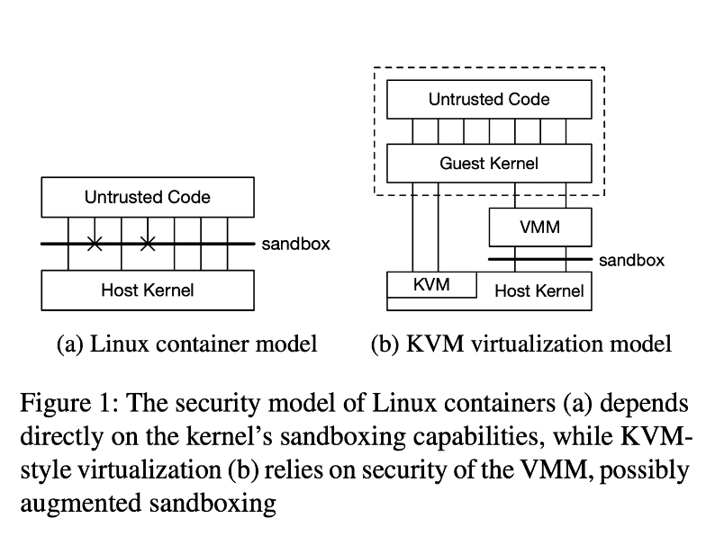
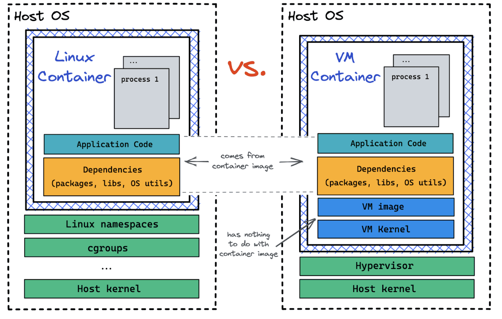
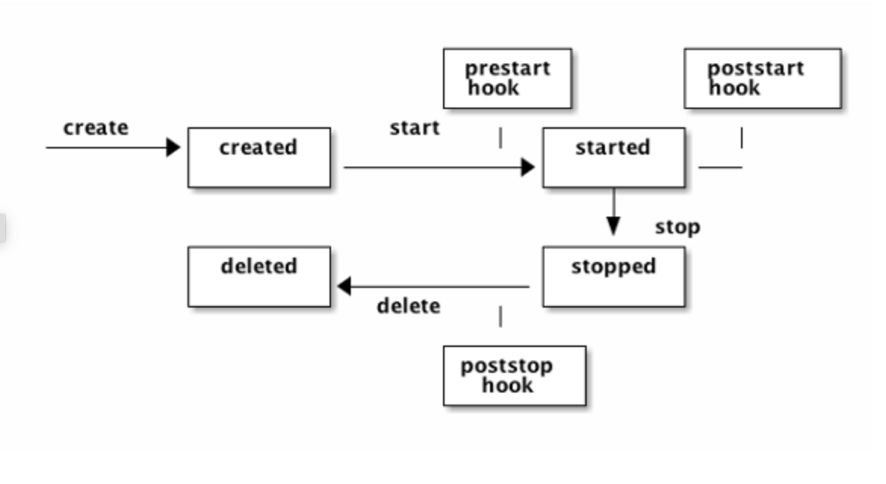
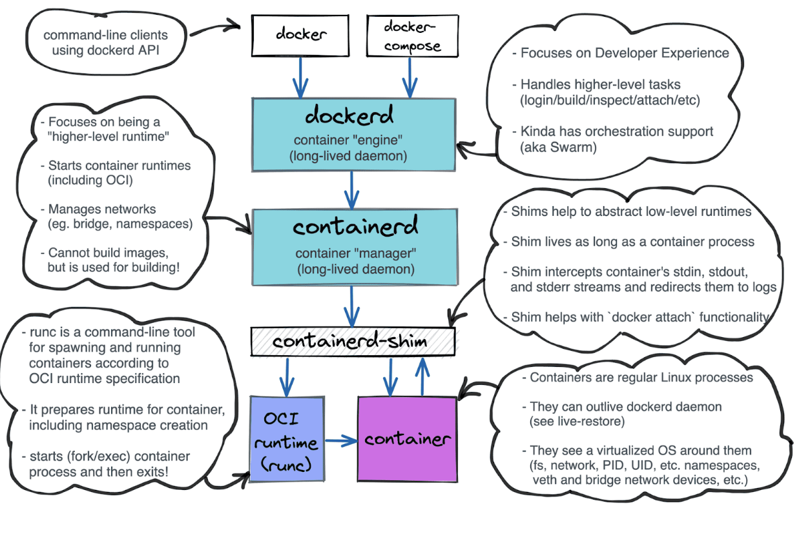
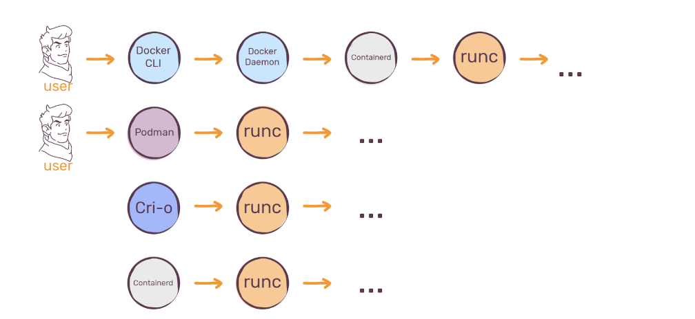
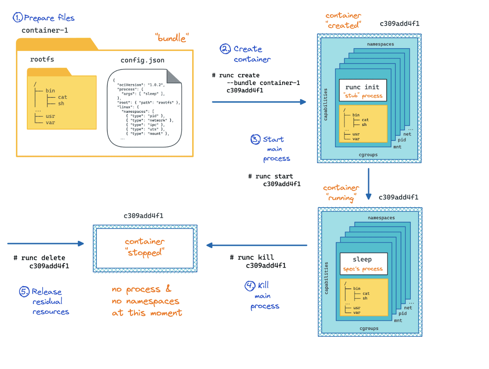
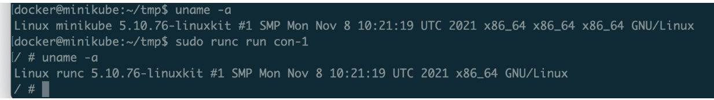

## Background

* Interesting facts:
  * Containers are isolated and restricted boxes for running processes 
  * Containers pack an app and all its dependencies (including OS libs) together
  * Containers are for portability
  * Containers can be implemented using Linux, Windows, and other OS-es
  * Virtual  Machines also can be used as standard containers

## Why do we need it?

* Software is hard to maintain, especially with complicated architectures and different hardware platforms. The underlying machine's differences can introduce many unexpected problems for software running. 

* To encapsulate a software component and all its dependencies in a format that is self-describing and portable, so that any compliant runtime can run it without extra dependencies.

## User cases

* Container is fast and low-cost. Using a container as a lightweight VM-like solution, creating a container is less than one second, much quicker than creating a VM in a host.

* Container is portable: Transparent the underlying hardware and OS details.

## What’s the container?

* Container is an environment for executing processes with configurable isolation and resource limitations.

* A container is an isolated (namespace) and restricted(cgroups, capabilities, seccomp which short for secure computing mode) process. (in Linux scenario)

### Interesting facts:

1. Linux containers are so fast because they are regular Linux processes, So they are as secure as the underlying Linux host. For a big tech company/platform, using Linux containers to run workloads of different customers on some host would be a security nightmare. 

2. **AWS Firecracker** is a micro-virtual machine, which uses KVM(Kernel-based virtual machines is a virtualization module in the Linux kernel that allows the kernel to function as a hypervisor, it was released on February 5, 2007, in Linux kernel version 2.6.20). 	

3. Firecracker is a secure/ high performance/ battled-tested / low overhead/ open-sourced product.  

### VM based container VS Linux process based container

## What’s the OCI runtime spec?

* Open container initiative develops specifications for standards on Operating System processes and application containers.
* It aims to specify the configuration, execution environment, and life cycle of a container.
* **OCI** is an open governance structure established in 2015 by Docker and other prominent players in the container industry to express the purpose of creating open industry standards around container formats and runtimes.

## Architecture

### What’s the `runc` tool?

* `runc` is an CLI tool for spawning and running container on Linux according to the OCI specification 

## How to use it?

1. Extracting the rootfs from a busybox docker image, run the command below: 
​​
`docker export $(docker create busybox) | tar -C rootfs -xvf -`

2. Copying the rootfs bundle into minikube virtual machine, using the command below:

`minikube cp ./rootfs /home/docker/tmp`

3. Generating the spec from, run the command below:

`runc spec`

It will general the basic spec for the demo container

4. Running the example container, with the root privilege  

`sudo runc run container-1`

as we can see, with the default spec and system file bundle from the `busybox` example image, we can pull up one docker container without direct using docker command.

At last, we can see one simple terminal as usual

## Take away

1. Containers are isolated and restricted boxes for running processes
2. Containers pack an app and all its dependencies (including OS libs) together
3. `Runc` is the CLI for running OCI spec tool

 

## References
1. https://aws.amazon.com/blogs/aws/firecracker-lightweight-virtualization-for-serverless-computing/
2. https://www.usenix.org/system/files/nsdi20-paper-agache.pdf
3. https://mkdev.me/posts/the-tool-that-really-runs-your-containers-deep-dive-into-runc-and-oci-specifications
4. https://man7.org/linux/man-pages/man7/capabilities.7.html
5. https://iximiuz.com/en/posts/container-learning-path/

