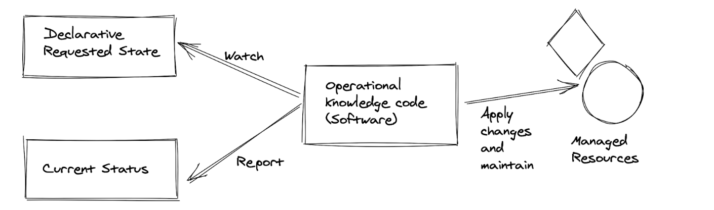

## Background

* SaaS products run in the cloud environment nowadays. The K8s is a winner in container orchestration systems. 
* The main pattern of K8s is a level-triggered loop for making sure everything inside keeps aligned with the desired state
* K8s focuses on container orchestration, automation, and cloud-native deployment patterns. It has many concepts inside. Developers want to extend K8s for their business domain requirements with the native K8s capacity.


## Why do we need it?

* The focusness of K8s also limits and restricts the set of commands and operations that are exposed through K8s APIs.
* The special user cases must not invade the infraction codes.  

* So K8s provide a standard and clean method for extension powered by K8s’ existing capabilities.


## User cases

1. Customize the CICD pipeline, combining the K8s deployment capabilities, and extends it with canary deployment

2. Reusing K8s concepts to achieve service mesh patterns

3. Reusing K8s stateful set concepts to achieve ETCD cluster

   


## What’s the operator?

* Operators are software extensions that use customer resources to manage applications and their components

* The operator is not an actual running component or resource stored inside K8s. It’s a guideline and abstraction of software patterns in the K8s context. It consists of one dedicated controller.


## Architecture



### Components
1. CRD: The CustomResourceDefinition API resource allows you to define custom resources. Defining a CRD object creates a new custom resource with a name and schema that you specify. The Kubernetes API serves and handles the storage of your custom resource. The name of a CRD object must be a valid DNS subdomain name.
   

2. Customer Controller: the orreponding controller for responsing the customer resources' modification and status.
   
   
3. CR: Custom resources are extensions of the Kubernetes API. This page discusses when to add a custom resource to your Kubernetes cluster and when to use a standalone service. It describes the two methods for adding custom resources and how to choose between them.


 

## How to develop it?

Env: MacBook

Pre-requirements：

1. docker is running
2. minikube is installed
   

### 1. Pull up the minikub and K8s cluster

``` bash
➜  crds minikube start init

```

### 2.Using init command to generate case docs

* create one directory for your CRD controller dir , let's make it at `/Users/benjamin/programmer/crds`

```bash
➜  crds git clone https://github.com/operator-framework/operator-sdk
➜  crds cd operator-sdk ; make install 
➜  crds cd ..
➜  crds go mod init example.com/m  # for init the golang repo env 
➜  crds operator-sdk init          # adding the basic controller files
```


### 3.Create the desired controller with your type

* create the new CRD with the name `Coolx`
* install the corresponding YAML, including RBAC, NS, CRD and so on. 

```bash
➜  crds operator-sdk create api --version=v1alpha1 --kind=Coolx
Create Resource [y/n]
y
Create Controller [y/n]
y
Writing kustomize manifests for you to edit...
Writing scaffold for you to edit...
api/v1alpha1/coolx_types.go
controllers/coolx_controller.go
Update dependencies:
$ go mod tidy
Running make:
$ make generate
mkdir -p /Users/benjamin/programmer/crds/bin
GOBIN=/Users/benjamin/programmer/crds/bin go install sigs.k8s.io/controller-tools/cmd/controller-gen@v0.8.0
/Users/benjamin/programmer/crds/bin/controller-gen object:headerFile="hack/boilerplate.go.txt" paths="./..."
Next: implement your new API and generate the manifests (e.g. CRDs,CRs) with:
$ make manifests
➜  crds make install 


➜  crds k get crds 
NAME                    CREATED AT
coolxes.mydomainx.com   2023-05-26T12:13:28Z
hellos.my.domain        2023-05-26T11:17:57Z

```

we can see the new added CRDs, which is named with `coolxes.mydomainx.com`  (`hellos.my.domain` is the original demo CRD in the repo )


### 4. Adding the logic of new kind in the controller

* Adding our newly added CRD's controller logic: **once created the dedicated CRD, create one Pod for it if not exist**
* The pod is running with the`busybox` image 
* the controller's golang code is in `/Users/benjamin/programmer/crds/controllers/coolx_controller.go` 

```go
/*
Copyright 2022.

Licensed under the Apache License, Version 2.0 (the "License");
you may not use this file except in compliance with the License.
You may obtain a copy of the License at

    http://www.apache.org/licenses/LICENSE-2.0

Unless required by applicable law or agreed to in writing, software
distributed under the License is distributed on an "AS IS" BASIS,
WITHOUT WARRANTIES OR CONDITIONS OF ANY KIND, either express or implied.
See the License for the specific language governing permissions and
limitations under the License.
*/

package controllers

import (
	"context"

	corev1 "k8s.io/api/core/v1"
	"k8s.io/apimachinery/pkg/api/errors"
	metav1 "k8s.io/apimachinery/pkg/apis/meta/v1"
	"k8s.io/apimachinery/pkg/runtime"
	"k8s.io/apimachinery/pkg/types"
	ctrl "sigs.k8s.io/controller-runtime"
	"sigs.k8s.io/controller-runtime/pkg/client"
	"sigs.k8s.io/controller-runtime/pkg/controller/controllerutil"
	logf "sigs.k8s.io/controller-runtime/pkg/log"
	"sigs.k8s.io/controller-runtime/pkg/manager"
	"sigs.k8s.io/controller-runtime/pkg/reconcile"

	mydomainv1alpha1 "example.com/x/api/v1alpha1"
)

var AddToManagerFuncs []func(manager.Manager) error
var log = logf.Log.WithName("controller_cool")

// CoolReconciler reconciles a Cool object
type CoolxReconciler struct {
	client.Client
	Scheme *runtime.Scheme
}

//+kubebuilder:rbac:groups=my.domain,resources=cools,verbs=get;list;watch;create;update;patch;delete
//+kubebuilder:rbac:groups=my.domain,resources=cools/status,verbs=get;update;patch
//+kubebuilder:rbac:groups=my.domain,resources=cools/finalizers,verbs=update

// Reconcile is part of the main kubernetes reconciliation loop which aims to
// move the current state of the cluster closer to the desired state.
// TODO(user): Modify the Reconcile function to compare the state specified by
// the Cool object against the actual cluster state, and then
// perform operations to make the cluster state reflect the state specified by
// the user.
//
// For more details, check Reconcile and its Result here:
// - https://pkg.go.dev/sigs.k8s.io/controller-runtime@v0.11.2/pkg/reconcile
func (r *CoolxReconciler) Reconcile(ctx context.Context, req ctrl.Request) (ctrl.Result, error) {
	reqLogger := log.WithValues("Request.Namespace", req.Namespace, "Request.Name", req.Name)
	reqLogger.Info("Reconciling Cool")

	instance := &mydomainv1alpha1.Coolx{}
	err := r.Get(context.TODO(), req.NamespacedName, instance)
	if err != nil {
		if errors.IsNotFound(err) {
			return reconcile.Result{}, nil
		}
		return reconcile.Result{}, err
	}

	pod := newPodForCR(instance)
	// Set Traveller instance as the owner and controller
	if err := controllerutil.SetControllerReference(instance, pod, r.Scheme); err != nil {
		return reconcile.Result{}, err
	}
	// TODO(user)a: your logic here
	// Check if this Deployment already exists
	found := &corev1.Pod{}
	err = r.Client.Get(context.TODO(), types.NamespacedName{Name: pod.Name, Namespace: pod.Namespace}, found)

	if err != nil && errors.IsNotFound(err) {
		reqLogger.Info("Creating a new Pod", "Pod.Namespace", pod.Namespace, "Pod.Name", pod.Name)
		err = r.Client.Create(context.TODO(), pod)
		if err != nil {
			return reconcile.Result{}, err
		}

		// Pod created successfully - don't requeue
		return reconcile.Result{}, nil
	} else if err != nil {
		return reconcile.Result{}, err
	}

	log.Info("Skip reconcile: pod already exists",
		"Pod.Namespace", found.Namespace, "Pod.name", found.Name)
	return ctrl.Result{}, nil
}

// newPodForCR returns a busybox pod with the same name/namespace as the cr
func newPodForCR(cr *mydomainv1alpha1.Coolx) *corev1.Pod {
	labels := map[string]string{
		"app": cr.Name,
	}
	return &corev1.Pod{
		ObjectMeta: metav1.ObjectMeta{
			Name:      cr.Name + "-pod",
			Namespace: cr.Namespace,
			Labels:    labels,
		},
		Spec: corev1.PodSpec{
			Containers: []corev1.Container{
				{
					Name:    "busybox",
					Image:   "busybox",
					Command: []string{"sleep", "3600"},
				},
			},
		},
	}
}

// SetupWithManager sets up the controller with the Manager.
func (r *CoolxReconciler) SetupWithManager(mgr ctrl.Manager) error {
	return ctrl.NewControllerManagedBy(mgr).
		For(&mydomainv1alpha1.Coolx{}).
		Complete(r)
}

```


* the logic above is listening the customer resource, checking the corresponding Pod is exist or not. If not present, then creating an Pod with busybox image.


### 5.Run the controller

```bash 
➜  crds  make run                          
/Users/benjamin/programmer/crds/bin/controller-gen rbac:roleName=manager-role crd webhook paths="./..." output:crd:artifacts:config=config/crd/bases
/Users/benjamin/programmer/crds/bin/controller-gen object:headerFile="hack/boilerplate.go.txt" paths="./..."
go fmt ./...
go vet ./...
go run ./main.go


1.6851043860176709e+09	INFO	controller-runtime.metrics	Metrics server is starting to listen	{"addr": ":8080"}
1.685104386018164e+09	INFO	setup	starting manager
1.6851043860184672e+09	INFO	Starting server	{"path": "/metrics", "kind": "metrics", "addr": "[::]:8080"}
1.6851043860184672e+09	INFO	Starting server	{"kind": "health probe", "addr": "[::]:8081"}
1.6851043860185852e+09	INFO	controller.coolx	Starting EventSource	{"reconciler group": "mydomainx.com", "reconciler kind": "Coolx", "source": "kind source: *v1alpha1.Coolx"}
1.6851043860186272e+09	INFO	controller.coolx	Starting Controller	{"reconciler group": "mydomainx.com", "reconciler kind": "Coolx"}
1.685104386119235e+09	INFO	controller.coolx	Starting workers	{"reconciler group": "mydomainx.com", "reconciler kind": "Coolx", "worker count": 1}


```


### 6. Apply the CRD for testing

* Create one new added custom resource object in K8s 

```bash
➜  crds k apply -f config/samples/_v1alpha1_coolx.yaml 
coolx.mydomainx.com/coolx-sample created


```

* we can see the corresponding log in the terminal output 

```bash


1.685105347743328e+09	INFO	controller_cool	Reconciling Cool	{"Request.Namespace": "default", "Request.Name": "coolx-sample"}
1.68510534784796e+09	INFO	controller_cool	Creating a new Pod	{"Request.Namespace": "default", "Request.Name": "coolx-sample", "Pod.Namespace": "default", "Pod.Name": "coolx-sample-pod"}


```

* get Pod in default NS, yes, the Pod binding to the crd is created

```bash
➜  crds k get pods
NAME               READY   STATUS    RESTARTS   AGE
coolx-sample-pod   1/1     Running   0          111s

```


## Takeaways 

1. K8s uses an operator pattern for extending its capacity.
2. Using operator-sdk simplifies our K8s operator development


## References
1. https://www.cncf.io/blog/2022/06/15/kubernetes-operators-what-are-they-some-examples/

2. https://github.com/cncf/tag-app-delivery/blob/main/operator-wg/whitepaper/Operator-WhitePaper_v1-0.md

3. https://medium.com/tech-vichaar/hello-world-with-operator-sdk-526d956452ed


