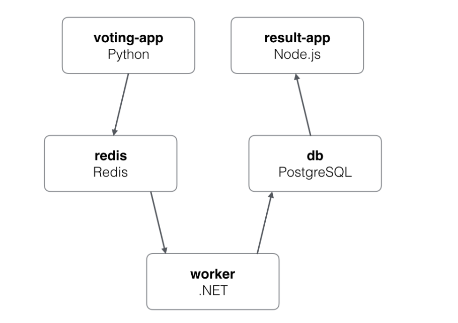

## Background
* Docker becomes a standard business logic service reused deployment solution. Containerized technology makes reusing backend servers more easily and more smoothly. 

Going back in time ： cgroup


## Why do we need it?
* The X problem: We want to manage container-based applications more efficiently in a hybrid cloud environment. Including deploying, upgrading, scaling, stack-like relation management, network accessibility, reliability, and so on. 


* It usually works with DDD solutions and microservices architecture.

  


## User cases 

| Company   | Product                    | Usage                                                        |
| --------- | -------------------------- | ------------------------------------------------------------ |
| Amazon    | Amazon EC2                 | K8s manage clusters for Amazon EC2, compute instances as well as run containers on these instances using process of deployment, maintenance, and scaling |
| Microsoft | Azure Kubernetes Services  | AKS is a completely managed service the enables Kubernetes in Azure, without having to manage Kubernetes clusters separately. |
| Apache    | Apache spark               | Spark creates its own driver which runs within the Kubernetes Pod. The driver then creates executors that also run within Kubernetes pods, connections them, and then executes the application code |
| Bloomberg | Bloomberg’s early adoption | Kubernetes has enabled them to work on a PaaS layer which gives the developers the right level of abstraction to work with. The major objective for Bloomberg was to efficiently utilize the existing hardware they had already invested in. |
| Google    | Kubernetes Engine          | Providing automated container orchestration, Kubernetes improves a Company’s reliability and reduces the time and effort of a resource. |
| Nintendo  | PokemonGo                  | The game had more than 500 million downloads and more than 20 million active users. GKE helps the company to not only serve, by allowing Niantic to improve their user’s experience but also add newer features to the application. |


## What’s Kubernetes

* Kubernetes is an open-source system for automating deployment, scaling, and management of containerized applications. 

* Declarative vs Imperative: declarative is the principle of K8s. Comparing the declarative type implementation with Epoll’s level trigger and edge trigger type mechanism. 

### Comparison
Docker swarm

* It has been abandoned by Docker Inc. Not being active anymore.

* It can run and connect multiple containers on different hosts. 

Docker-compose 

* Compose is a tool for defining and running multi-container Docker applications. With compose, you use a YAML file to configure your application services. Then, with a single command, you create and start all the services from your configuration.

* A docker-compose example


``` yaml
version: "3"
services:
  redis:
    image: Redis:alpine
    networks:

   - frontend
     ploy:
           replicas: 1
           update_config:
     parallelism: 2
     delay: 10s
           restart_policy:
     condition: on-failure
       db:
         image: postgres:9.4
         environment:
           POSTGRES_USER: "postgres"
           POSTGRES_PASSWORD: "postgres"
         volumes:
        - db-data:/var/lib/postgresql/data
          tworks:
             - backend
               ploy:
                     placement:
               constraints: [node.role == manager]
                 vote:
                   image: dockersamples/examplevotingapp_vote:before
                   ports:
                  - 5000:80
                    tworks:
                       - frontend
                         pends_on:
                            - redis
                              ploy:
                                    replicas: 2
                                    resources: 
                              limits: 
                                cpus: '0.001' 
                                memory: 50M 
                              reservations: 
                                cpus: '0.0001' 
                                memory: 20M
                                    update_config:
                              parallelism: 2
                                    restart_policy:
                              condition: on-failure
                                result:
                                  image: dockersamples/examplevotingapp_result:before
                                  ports:
                                 - 5001:80
                                   tworks:
                                      - backend
                                        pends_on:
                                           - db
                                             ploy:
                                                   replicas: 1
                                                   update_config:
                                             parallelism: 2
                                             delay: 10s
                                                   restart_policy:
                                             condition: on-failure

  worker:
    image: dockersamples/examplevotingapp_worker
    networks:
      - frontend
      - backend
    depends_on:
      - db
      - redis
    deploy:
      mode: replicated
      replicas: 1
      labels: [APP=VOTING]
      restart_policy:
        condition: on-failure
        delay: 10s
        max_attempts: 3
        window: 120s
      placement:
        constraints: [node.role == manager]

  visualizer:
    image: dockersamples/visualizer:stable
    ports:
      - "8080:8080"
    stop_grace_period: 1m30s
    volumes:
      - "/var/run/docker.sock:/var/run/docker.sock"
    deploy:
      placement:
        constraints: [node.role == manager]

networks:
  frontend:
  backend:

volumes:
  db-data:
```


* Architecture

  

* Using docker-compose, we can define a stack-like application package. The operator and developer can manage application dependence, network accessibility, and replica numbers in one YAML file. 

* It includes container running images, volumes defined, network policies, and starting sequence. It’s an all-in-one solution for a single host. 


|      | Docker swarm                                                 | Kubernetes                                                   |
| ---- | ------------------------------------------------------------ | ------------------------------------------------------------ |
| Pros | Built for use with the Docker engine                         | Battle-tested by big players like Google and IBM. Runs on most operating systems. |
|      | Easy to install and set up for Docker environment            | Largest adoption in the market                               |
|      | Uses a filtering and scheduling system to provide intelligent node selection, allowing you to pick the optimal nodes in a cluster for container deployment | Unified set of APIs and strong guarantees about the cluster state |
|      | Smoothly integrates with Docker tools like Docker Compose and Docker CLI (uses the same command line interface (CLI) as Docker Engine) | Key functionalities include service discovery, ingress and load balancing, self-healing, storage orchestration, horizontal scalability, automated rollouts and rollbacks |
| Cons | Limited customizations and extensions                        | Management of Kubernetes master takes specialized knowledges |
|      | Less functionality-rich than Kubernetes                      | Too heavyweight for individual developers to set up for simplistic apps and infrequent deployment |
|      | No easy way to separate Dev-Test-Prod workloads in DevOps pipeline | Often need additional tools (e.g., kubectl CLI), services, continuous integration/continuous deployment (CI/CD) workflows and other DevOps practices to fully manage access, identity, governance and security |


### Architecture 


* Control plane: Controller manager/API server/Scheduler/Etcd 
* Data plane: Kubelet/kube-proxy 


## How to use it? 
Follow the official tutorials in Kubernetets.io https://kubernetes.io/docs/tutorials/ 


## Take away
1. K8s a automating deploying, scaling containerized based applications system. 
2. K8s’s principle is being declarative.  
3. We can reluctantly think of K8s as a splitted and enhanced version’s docker compose.  


## References

1. https://hackernoon.com/practical-introduction-to-docker-compose-d34e79c4c2b6
2. https://stackoverflow.com/questions/47536536/whats-the-difference-between-docker-compose-and-kubernetes
3. https://www.cloudsavvyit.com/15055/declarative-vs-imperative-kubernetes-object-management/
4. https://pediaa.com/what-is-the-difference-between-edge-and-level-triggering/
5. https://wisdomplexus.com/blogs/kubernetes-use-cases-and-examples
6. https://www.ibm.com/cloud/blog/docker-swarm-vs-kubernetes-a-comparison
