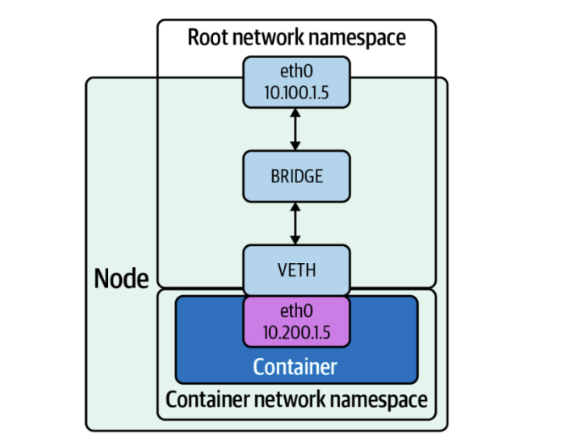
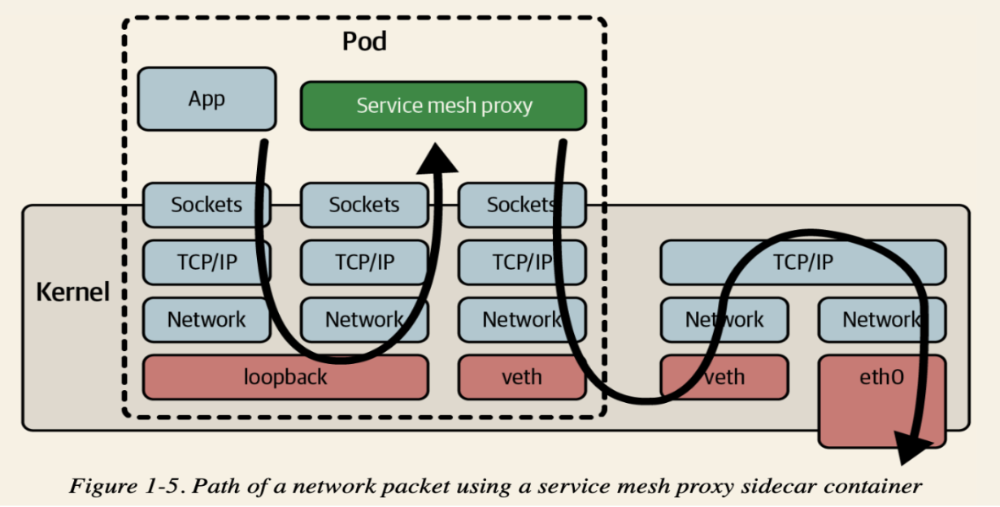
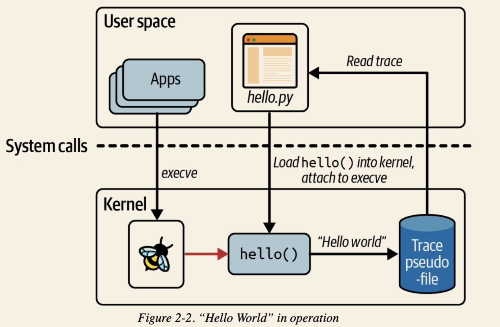
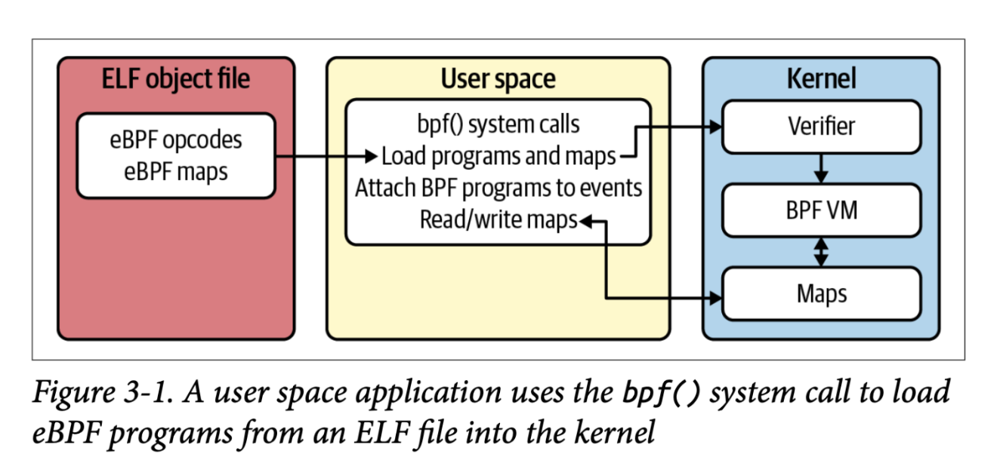
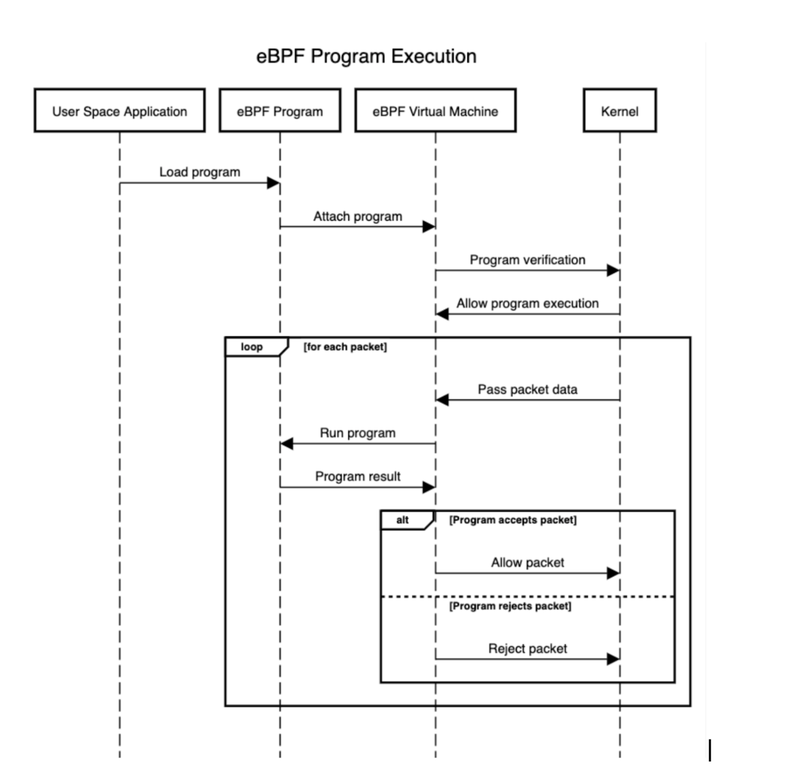
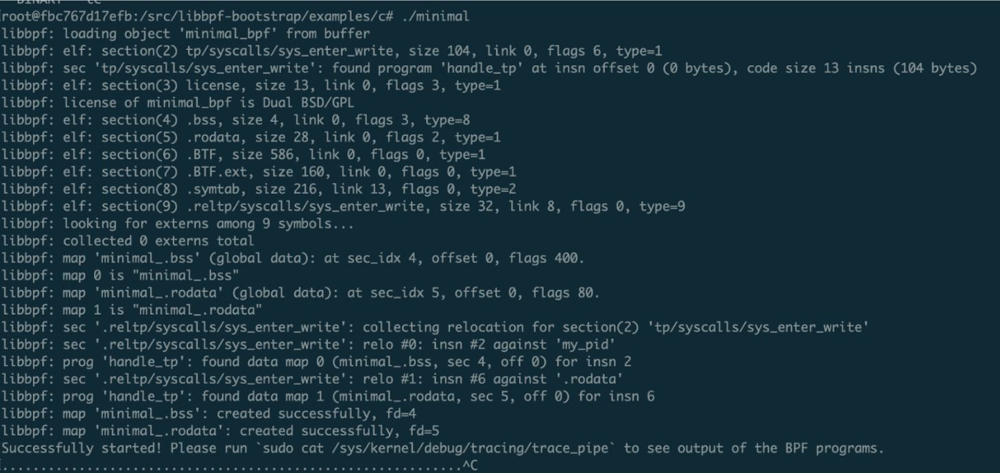
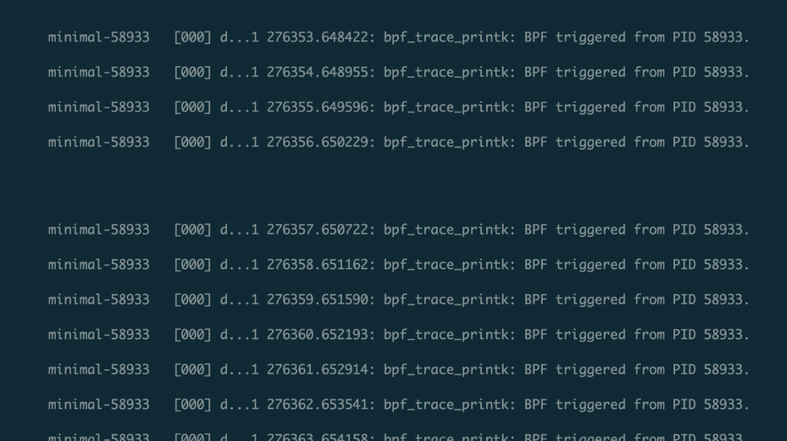

## Background

* In distributed system + microservice area, traffic inside systems(east-west traffic) becomes more and more popular


* In 1990s, Berkeley Packet Filter(BPF) was developed to filter packets as the kernel level, and was later integrated into the Linux kernel（wireshark/tcpdump）

* In 2014, Google engineer proposed extending the BPF infrastructure to allow user-defined program to be loaded into the kernel. It became the eBPF and was merged into the Linux kernel in 2015.


## Why do we need it?
* Service mesh architecutre is beocming more and more popular. With service mesh, dev can solve the microservice  governance problems including deployment, management, and observability efficiently. 

| pros                          | Cons                                                  |
| ----------------------------- | ----------------------------------------------------- |
| Service discovery and routing | Increased complexity: adds another layer, the sidecar |
| Security                      | Performance overhead: additional network hops.        |
| Observibility                 | Hihg learning curve                                   |
| Salability                    | Vendor lock-in                                        |






## User cases 

- Efficient packet filtering: Service mesh proxies such as Istio rely on packet filtering(IPtable/IPVS) to route traffic between services. This filtering was done using user-space networking stacks, which can be slow and inefficient. eBPF can be used to perform packet filtering in the kernel, which is much faster and efficient. It can improve the performance of service mesh proxies and reduce latency.
  
  
- Dynamic load balancing: Service mesh proxies often use dynamic load balancing to distribute traffic between services. eBPF can be used to implement dynamic load balancing in the kernel, which can be faster and more efficient than doing it in user space. This can reduce latency and improve overall performance.
  

- Customized traffic management: eBPF can be used to implement custom traffic management policies in the kernel. It can be used to implement canary deployment, traffic prioritization, and traffic redirection. 
  

- Kernel-level telemetry: eBPF can be used to collect telemetry data from the kernel, such as network statistics and performance metrics. This data can be used to optimize the performance of service mesh proxies and identify performance bottlenecks.


## What's eBPF

- eBPF is a technology for running custom programs in the Linux kernel without modifying the kernel code itself.
  

- It allows developers to write custom programs in a restricted subset of the C programming language that are compiled to bytecode and loaded into the kernel at runtime.

  

- The eBPF programs can interact with various kernel subsystems, making it a powerful tool for implementing custom behavior in the kernel and for gathering insights into system behavior.

  

- It’s safe. Its bytecode is verified for safety before execution, preventing eBPF programs from causing crashes or security vulnerabilities in the kernel. 

Overall, eBPF is a powerful and flexible technology for customizing the behavior of the Linux kernel and building advanced monitoring and analysis tools, making it a popular choice among developers in the Linux ecosystem.


### Architecture








## How to use it? 

Env : MacBook OS, with docker installed

1. Prepare the Linux env, and basic libary installed 

   ```yaml
   #Caution, don't use the latest image, or it will faild at eBPF header file 
   FROM ubuntu:20.14 
   
   RUN apt-get update && \
       apt-get install -y build-essential git cmake \
                          zlib1g-dev libevent-dev \
                          libelf-dev llvm \
                          clang libc6-dev-i386
   
   RUN mkdir /src && \
       git init
   WORKDIR /src
   
   # Link asm/byteorder.h into eBPF
   RUN ln -s /usr/include/x86_64-linux-gnu/asm/ /usr/include/asm
   
   # Build libbpf as a static lib
   RUN git clone https://github.com/libbpf/libbpf-bootstrap.git && \
       cd libbpf-bootstrap && \
       git submodule update --init --recursive
   
   RUN cd libbpf-bootstrap/libbpf/src && \
       make BUILD_STATIC_ONLY=y && \
       make install BUILD_STATIC_ONLY=y LIBDIR=/usr/lib/x86_64-linux-gnu/
       
   # Clones the linux kernel repo and use the latest linux kernel source BPF headers 
   RUN git clone --depth 1 git://git.kernel.org/pub/scm/linux/kernel/git/stable/linux.git && \
       cp linux/include/uapi/linux/bpf* /usr/include/linux/
   ```

   save the YAML above into dockerfile, run `docker build -t ebpf-demo:0.0.1 ` in the same directory of the docker file

2. Run the container with privilege, special for eBPF env, and mount the debufs for running code example in https://github.com/libbpf/libbpf-bootstrap.git 
   ```bash
   $ docker run -it --privileged ebpf-demo:0.0.1 
   
   ... inside container 
   $ mount -t debugfs none /sys/kernel/debug
   
   ```

3. In the container, run the example with path ` /src/libbpf-bootstrap/examples/c/minimal` 

   

   But wait, the example code will listen all triggered fd event in Linux, and filter the event triggered by itself, then print it in terminal. Current we can see nothing happended, Why? 

4. After examing the source code of minimal.c, we can see that, it uses two different way to get the thread's PID, 
   one is https://github.com/libbpf/libbpf-bootstrap/blob/master/examples/c/minimal.c#L30 , the other is 
   https://github.com/libbpf/libbpf-bootstrap/blob/master/examples/c/minimal.bpf.c#L13, aftering debuging, we can find out, that's two different value, so the pid filtering will never succ,that the surface resaon for the slience output of running the example.

5. In order to fix this problem, we need to coordinate two method to get the same PID, the core reason I won't analysis here, just provide the solution, rerun the docker command blow, 
   ```bash
   $ docker run -it --privileged --pid=host ebpf-demo:0.0.1
   ```

​		rerun the step from 2 - 3, u can see the only events belong to this thread



## Take away

1. In the traffic governance scenario，eBPF solutions will be the future. 


## References

1. https://andreybleme.com/2022-05-22/running-ebpf-programs-on-docker-containers/

