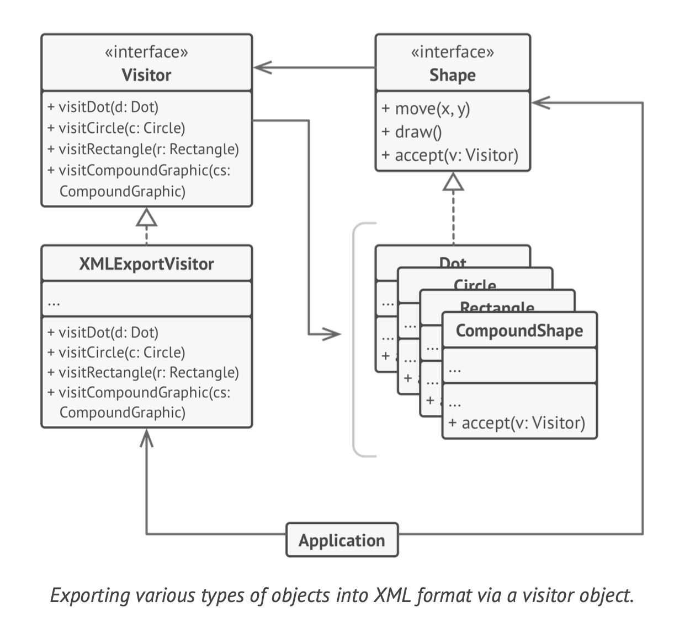
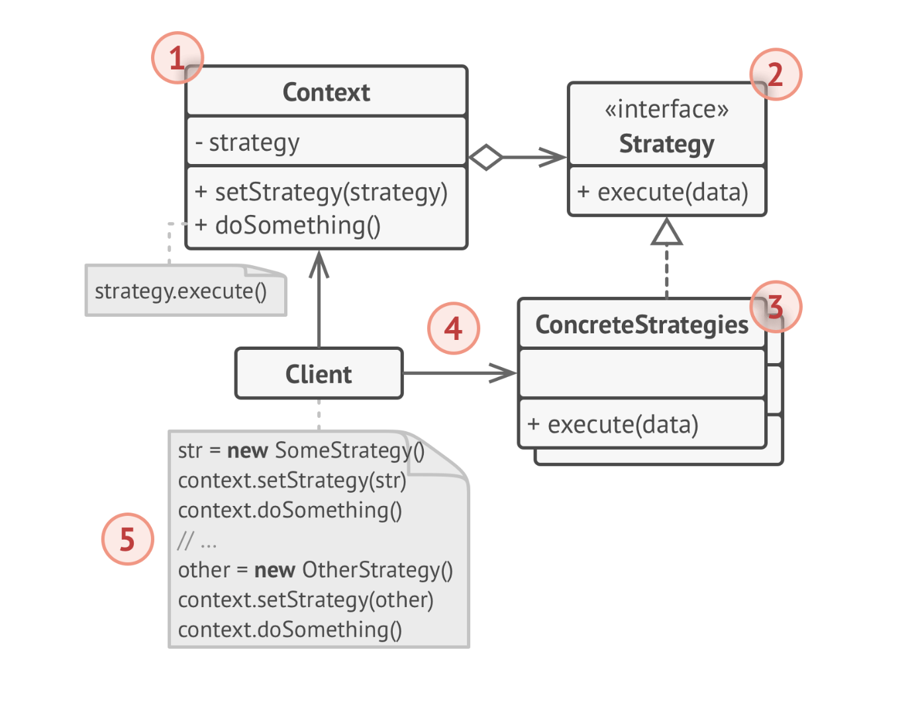

## Background

* As the software evolution procssing, codes change frequently.  
  
* The idea of applying patterns to software design was inspired by the work of an architect, Christopher Alexander, who proposed the idea of using patterns to document good design practices. Alexander used patterns to solve problems in urban planning and building architecture, and his ideas were then adapted for software engineering by the Gang of Four.
  
* In the realm of software development, patterns represent reusable solutions to commonly occurring problems. They provide a way to give a name to complex structures or processes, which in turn supports common understanding and communication among developers.


## Why do we need it?

* We need to find a way for more reasonable way to change the exist code base for new features.

* Ioslation code changing makes sure more reliable and less bugs during the developments.

* The design patterns provide clear ways to handle complex interactions between objects, allowing developers to make changes with fewer unintended side effects, and making the code more robust, flexible, and maintainable.


## User cases

1. In a 3D game engine, different operations need to be performed on 3D shapes. To avoid adding these operations to the shapes classes (like sphere, cube, etc.), a Visitor class can be created that performs these operations.

   

2. In a graphical user interface toolkit, the Decorator pattern can be used to add graphical features (like borders, shadows, etc.) to a window. By using the decorator, these features can be added to or removed from the window dynamically at runtime.
   

3. An application that supports different file types might implement different strategies for reading these file types. For example, one strategy could be for reading PDF files, another for Word documents, and another for Excel spreadsheets. When the application is asked to open a file, it can select the appropriate strategy based on the file type.


## What are the behavior patterns?

Behavioral patterns are all about communication between objects, how they operate, and the roles they play. They help in flexible and efficient communication between objects.


* **Strategy Pattern**: This pattern enables a strategy (algorithm) to be chosen at runtime. It defines a family of algorithms, encapsulates each one, and makes them interchangeable. 

* **Visitor Pattern**: This pattern is used for adding new operations to existing class structures without modifying them. It provides a way to separate an algorithm from the object structure that it operates on.

| pattern names | pros                                                                                                                                                                                                                                              | Cons                                                                                                                                                                               |
| ------------- | ------------------------------------------------------------------------------------------------------------------------------------------------------------------------------------------------------------------------------------------------- | ---------------------------------------------------------------------------------------------------------------------------------------------------------------------------------- |
| **strategy**  | **Flexibility**: The Strategy pattern allows an algorithm's behavior to be selected at runtime. This means you can switch strategies based on any condition                                                                                       | **Increased Number of Objects**: The use of the Strategy pattern increases the number of objects in an application. Each strategy is typically implemented in its own class.       |
|               | **Loose Coupling**: The pattern can provide a means to decouple the algorithms from the classes that use them.                                                                                                                                    | **Clients Must Be Aware of Strategies**: Clients must understand how different strategies differ before they can select the appropriate one.                                       |
|               | **Replace Inheritance with Composition**: It's an alternative to subclassing. Inheritance hard-codes the behavior into a class. The pattern allows you to change behaviors at runtime as you can inject a class with a different strategy object. | **Communication Overhead**: Communication between strategy and context class may involve extra overhead.                                                                           |
| **visitor**   | **Adding Operations**: The Visitor pattern allows adding new virtual functions to a family of classes without modifying the classes themselves.                                                                                                   | **Adding New Element Classes**: The Visitor pattern makes it hard to add new element classes. Each time a new element class is added, every visitor derived class must be amended. |
|               | **Separating Operations**: It separates an algorithm from the object structure on which it operates, promoting loose coupling.                                                                                                                    | **Breaking Encapsulation**: The pattern often forces you to provide public operations that access an object's internal state, which may compromise its encapsulation.              |
|               | **Accumulating State**: Visitors can accumulate state while traversing a set of elements. This can be useful if you need to traverse a structure and build a report or a summary of what you see.                                                 |                                                                                                                                                                                    |


## Architecture







## How to use these patterns?

### Strategy patterns

```go
type Strategy interface {
	Execute()
}

type ConcreteStrategyA struct{}

func (s *ConcreteStrategyA) Execute() {
	fmt.Println("Using Concrete Strategy A")
}

type ConcreteStrategyB struct{}

func (s *ConcreteStrategyB) Execute() {
	fmt.Println("Using Concrete Strategy B")
}

type Context struct {
	strategy Strategy
}

func NewContext(strategy Strategy) *Context {
	return &Context{strategy: strategy}
}

func (c *Context) ExecuteStrategy() {
	c.strategy.Execute()
}

func main() {
	strategyA := &ConcreteStrategyA{}
	context := NewContext(strategyA)
	context.ExecuteStrategy()

	strategyB := &ConcreteStrategyB{}
	context = NewContext(strategyB)
	context.ExecuteStrategy()
}

```


### Visitor pattern

```go
type Visitor interface {
	VisitConcreteElementA(*ConcreteElementA)
	VisitConcreteElementB(*ConcreteElementB)
}

type ConcreteVisitor struct{}

func (v *ConcreteVisitor) VisitConcreteElementA(element *ConcreteElementA) {
	fmt.Println("Visiting ConcreteElementA")
}

func (v *ConcreteVisitor) VisitConcreteElementB(element *ConcreteElementB) {
	fmt.Println("Visiting ConcreteElementB")
}

type Element interface {
	Accept(Visitor)
}

type ConcreteElementA struct{}

func (e *ConcreteElementA) Accept(visitor Visitor) {
	visitor.VisitConcreteElementA(e)
}

type ConcreteElementB struct{}

func (e *ConcreteElementB) Accept(visitor Visitor) {
	visitor.VisitConcreteElementB(e)
}

func main() {
	elements := []Element{&ConcreteElementA{}, &ConcreteElementB{}}
	visitor := &ConcreteVisitor{}

	for _, element := range elements {
		element.Accept(visitor)
	}
}

```


## Takeaways

1. Behavioral Patterns: These handle object interaction and distribution of responsibilities. They provide solutions for improving communication between objects.

2. **Strategy Pattern**: Provides flexibility by allowing you to choose from a family of algorithms at runtime. This enhances code reusability and separation of concerns.

3. **Visitor Pattern**: Allows you to add new operations to classes without changing them. This is useful when you need to extend a stable class structure without modifying it.


## References

1. Dive Into Design Patterns, Alexander Shvets
2. Design Patterns: Elements of Reusable Object-Oriented Software 